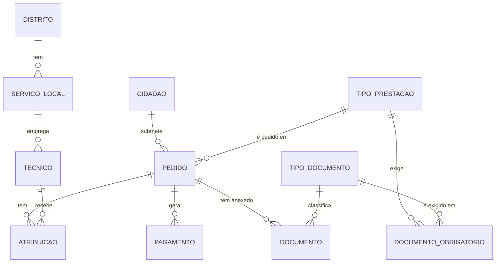

# DER conceptual: Sistema de Gestão de Prestações Sociais

> Versão 1 (em construção). Extraído da
> [entrevista com a coordenadora](../case-study/entrevista-01-coordenadora.md).
> Notação Crow's Foot, em Mermaid. O GitHub desenha o diagrama a partir do texto.

## Como ler

- O símbolo encostado a uma entidade diz **quantos dessa entidade**: `||` exatamente um,
  `o{` zero ou muitos.
- Cada linha responde a duas perguntas, uma por ponta. Ex.: "um cidadão submete quantos
  pedidos?" → zero ou muitos (`o{` junto a PEDIDO); "um pedido é submetido por quantos
  cidadãos?" → exatamente um (`||` junto a CIDADAO).

## Decisões de modelação

| Decisão | Origem na entrevista |
|---|---|
| **ATRIBUICAO** resolve o N:M Pedido–Técnico e guarda o histórico de reatribuições (datas de início e fim) | "Pode ser reatribuído… precisamos de saber sempre quem teve o pedido e quando" |
| **DOCUMENTO_OBRIGATORIO** resolve o N:M Tipo de prestação–Tipo de documento; a regra fica em dados, não em código | "A lista de documentos obrigatórios é diferente para cada tipo de prestação"; "vão entrar mais prestações… sem reprogramar" |
| **TIPO_DOCUMENTO** (catálogo) separado de **DOCUMENTO** (ficheiro entregue): tipo vs instância | "Cada pedido pode ter vários documentos… guardamos o tipo, a data de entrega e o ficheiro" |
| O **tipo de prestação** liga-se ao **pedido**, não ao pagamento: o pagamento obtém-no através do pedido, sem duplicar informação (evita dependência transitiva) | "Recebemos pedidos de prestações"; "um pedido deferido gera pagamentos" |
| Mínimo **zero** do lado "muitos" (`o{`) | Um cidadão pode não ter pedidos (ex.: dependentes); um pedido ainda não deferido não tem pagamentos |

## Em aberto

- Históricos ainda por modelar: morada, estados do pedido, IBAN, valor do escalão por ano.
- Relação de dependência entre cidadãos (N:M recursivo).
- Perguntas para o stakeholder: um serviço local pode existir sem técnicos? Um técnico pode
  cobrir temporariamente outro serviço local?
