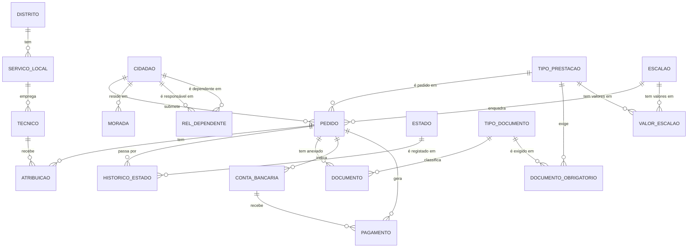

# DER conceptual: Sistema de Gestão de Prestações Sociais

> Versão 2. Extraído da [entrevista com a coordenadora](../case-study/entrevista-01-coordenadora.md)
> e da [folha de cálculo atual](../case-study/folha-pedidos-atual.md).
> Notação Crow's Foot, em Mermaid. O GitHub desenha o diagrama a partir do texto.

## Como ler

- O símbolo encostado a uma entidade diz **quantos dessa entidade**: `||` exatamente um,
  `o{` zero ou muitos.
- Cada linha responde a duas perguntas, uma por ponta, sempre a partir de **uma** instância.
  Ex.: "um cidadão submete quantos pedidos?" → zero ou muitos (`o{` junto a PEDIDO); "cada
  pedido é submetido por quantos cidadãos?" → exatamente um (`||` junto a CIDADAO).
- Uma entidade com **dois pés de galinha a apontar para ela** é uma entidade associativa: a
  resolução de um N:M.

## Método usado para chegar ao modelo

1. **Três lentes** sobre a entrevista: cada frase vai para *dados* (o que se guarda),
   *comportamento* (o que o sistema faz) ou *regras* (o que é permitido). Só os dados entram
   no DER; o comportamento vai para casos de uso e diagramas; as regras viram restrições.
2. **Substantivos** → candidatos a entidades ou atributos. **Verbos** → relacionamentos.
3. **Duas perguntas por relacionamento**, a partir de uma instância ("um A tem quantos B?",
   "cada B tem quantos A?"), com resposta tirada do que o negócio diz, não do que parece
   possível. Na dúvida, pergunta-se ao stakeholder.
4. **Sinais de histórico**: "ao longo do tempo", "quem teve e quando", "mudam todos os anos".
5. **Verificação**: o modelo deve formar um único bloco ligado. Uma entidade solta indica
   uma relação em falta.

## Decisões de modelação

| Decisão | Origem |
|---|---|
| **ATRIBUICAO** resolve o N:M Pedido–Técnico ao longo do tempo (datas de início e fim) | "Pode ser reatribuído… precisamos de saber sempre quem teve o pedido e quando" |
| **DOCUMENTO_OBRIGATORIO** resolve o N:M Tipo de prestação–Tipo de documento; a regra fica em dados, não em código | "A lista de documentos obrigatórios é diferente para cada tipo de prestação"; "vão entrar mais prestações… sem reprogramar" |
| **Tipo vs instância**: TIPO_DOCUMENTO (catálogo) ≠ DOCUMENTO (ficheiro entregue) | "Cada pedido pode ter vários documentos… guardamos o tipo, a data de entrega e o ficheiro" |
| **Catálogos (LOV)**: TIPO_PRESTACAO, TIPO_DOCUMENTO, ESTADO, ESCALAO | Listas de valores reutilizadas por muitos registos |
| **Histórico com vigência** (data início / data fim, fim vazio = atual): MORADA, CONTA_BANCARIA | "Mais do que uma morada ao longo do tempo… conta a morada em vigor na data do pedido"; "pode mudar o IBAN" |
| **Histórico de estados**: catálogo ESTADO + HISTORICO_ESTADO com a data de cada mudança | "Histórico de todos os estados com a data de cada mudança" |
| **Eventos não têm tabela de histórico**: cada PAGAMENTO já é um registo histórico | Um pagamento nunca é alterado, só acrescentado |
| **PAGAMENTO liga-se à CONTA_BANCARIA usada**, para saber para que IBAN foi cada pagamento | "Cada pagamento tem… o IBAN para onde foi" |
| **O tipo de prestação liga-se ao pedido, não ao pagamento**: o pagamento obtém-no pelo pedido (evita dependência transitiva) | "Um pedido deferido gera pagamentos" |
| **VALOR_ESCALAO** identificado pela chave composta (tipo de prestação, escalão, ano) | "Os valores de cada escalão mudam todos os anos" + a folha mostra valores diferentes por prestação |
| **REL_DEPENDENTE**: relacionamento **recursivo N:M** do cidadão consigo próprio, com duas FKs com papéis (responsável, dependente) e o atributo `tipo_relacao` | "Um dependente também é um cidadão… a mesma criança pode estar ligada a dois cidadãos" |
| **Chave substituta** (`id_cidadao`) + NISS único, em vez do NISS como PK | Estabilidade das FKs se o NISS tiver de ser corrigido |

## Cardinalidade vs relacionamento recursivo

São duas perguntas independentes. A tabela associativa é a técnica para implementar qualquer N:M.

| | Entre entidades diferentes | Recursivo (entidade consigo própria) |
|---|---|---|
| **1:N** | Serviço local → Técnico: FK no técnico | Categoria → categoria-mãe: FK `id_categoria_mae` na própria tabela |
| **N:M** | Pedido ↔ Técnico: tabela associativa ATRIBUICAO | Cidadão ↔ Cidadão: tabela associativa REL_DEPENDENTE com duas FKs para CIDADAO |

## Em aberto

- **Dependentes incluídos em cada pedido** (pedido ↔ cidadão dependente) e a regra "só um dos
  responsáveis pode receber o abono por essa criança".
- **Ligação da morada ao serviço local** (a área de residência define o serviço responsável):
  a modelar no modelo lógico.
- **Atributos** de cada entidade e **chaves** (modelo lógico).
- Perguntas para o stakeholder: um serviço local pode existir sem técnicos? Um técnico pode
  cobrir temporariamente outro serviço local? O escalão de um pedido pode mudar se os
  rendimentos forem reavaliados?
