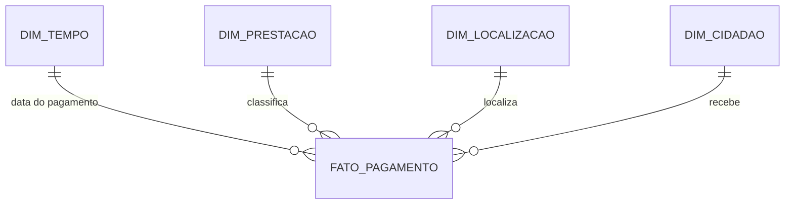

# Arquitetura de dados: do sistema transacional ao data warehouse

> Aplicada ao [caso de estudo](../case-study/). Cada secção termina com a forma de a explicar
> numa conversa técnica.

## 1. OLTP vs OLAP

Operar e analisar são trabalhos diferentes. Correr relatórios pesados no sistema transacional
prejudica quem está a operar, por isso os dados são extraídos periodicamente para um ambiente
analítico.

| | **OLTP** | **OLAP** |
|---|---|---|
| Para quê | Operar o negócio | Analisar e decidir |
| Operações | Inserir, alterar, apagar poucas linhas, muitas vezes | Ler muitas linhas, agregar |
| Dados | Atuais | Históricos |
| Modelo | Normalizado (3FN) | Desnormalizado (estrela) |
| Prioridade | Consistência e escrita rápida | Leitura rápida |

**O critério de classificação** não é "tem somas ou contagens", é: *dados atuais e operacionais,
ou históricos e para decisão?* "Quantos pedidos tem esta técnica neste momento?" é OLTP.

> **Na entrevista:** "Separamos o transacional do analítico porque têm cargas opostas. O OLTP
> faz muitas escritas pequenas e está normalizado; o OLAP faz leituras grandes de histórico e é
> desnormalizado. Os dados são extraídos periodicamente para o ambiente analítico."

## 2. ODS, data warehouse e data mart

```
OLTP  →  ODS  →  Data Warehouse  →  Data Marts  →  BI
operar   integrar   historiar        focar          visualizar
```

| | **ODS** | **Data warehouse** | **Data mart** |
|---|---|---|---|
| O que é | Cópia integrada e recente dos dados operacionais | Repositório central e histórico para análise | Pedaço do DW focado numa área |
| Horizonte | Recente, atualizado com frequência | Anos | O da área |
| Modelo | Próximo da origem, normalizado | Normalizado (Inmon) ou dimensional (Kimball) | Dimensional (estrela) |
| Para quê | Relatórios operacionais sem carregar o OLTP; integrar fontes | Análise histórica transversal | Análise de uma área |

**Escolher a camada pela pergunta:**
- Evolução de pagamentos por prestação e distrito em 5 anos → data warehouse, ou melhor, o
  **data mart de Pagamentos** (já em estrela).
- Pedidos que entraram hoje e ainda não têm técnico, atualizado várias vezes ao dia → **ODS**,
  desde que seja carregado com frequência suficiente (cargas frequentes ou **CDC**, captura de
  alterações). Se a exigência fosse tempo real, consulta controlada ao transacional.

Na prática, o ODS acumula muitas vezes dois papéis (integração e histórico), e as views
dimensionais por cima funcionam como data marts.

## 3. Modelo em estrela

| Conceito | O que é |
|---|---|
| **Tabela de factos** | Os eventos mensuráveis. Tem as **métricas** (números que se somam) e as chaves das dimensões |
| **Dimensões** | O contexto para filtrar e agrupar: quem, o quê, onde, quando |
| **Granularidade** | O que representa uma linha da fact. **É a primeira decisão**: aqui, "um pagamento mensal de um pedido" |



- **Cardinalidade:** o `||` fica sempre na dimensão e o `o{` na fact. A fact tem uma linha por
  evento (milhões); cada linha aponta para exatamente uma linha de cada dimensão. O centro é só
  o desenho, quem decide é qual lado tem muitas linhas.
- **Métricas vs chaves:** `valor_pago` é métrica; as chaves substitutas (`sk_`) ligam às
  dimensões e não se somam.
- **DIM_TEMPO é um calendário**: uma linha por dia, com dia, mês, nome do mês, trimestre, ano,
  dia da semana, feriado. Não leva colunas do sistema transacional (estado, auditoria).
- **DIM_PRESTACAO** descreve o **tipo**, com atributos estáveis (código, nome, categoria).
  Valores que mudam a cada mês, ou que descrevem um pedido concreto, não pertencem à dimensão.
- **Desnormalizar as dimensões é aceitável** porque no DW ninguém edita dados: o ETL carrega-os
  de forma controlada, por isso a redundância não causa anomalias, e ganha-se velocidade e
  simplicidade.
- **Floco de neve:** estrela com as dimensões normalizadas (DIM_LOCALIZACAO → serviço local →
  distrito). Poupa espaço, mas complica as consultas. A estrela é a regra por defeito.

> **Na entrevista:** "A tabela de factos tem uma linha por evento e as métricas; as dimensões
> dão o contexto e são desnormalizadas de propósito. Defino primeiro a granularidade. Prefiro a
> estrela ao floco de neve: menos joins, consultas mais simples e rápidas."

## 4. SCD: dimensões que mudam

A dimensão cresce ao ritmo das **mudanças**, não das transações. A Ana, com 200 pagamentos em
2025 (Leiria) e 12 em 2026 (Lisboa), e a Marta, que nunca mudou e tem 50 pagamentos, dão
**3 linhas** na DIM_CIDADAO (2 versões da Ana, 1 da Marta) e **262 linhas** na fact.

| Tipo | Faz | Os pagamentos de 2025 da Ana contam em… | Histórico |
|---|---|---|---|
| **1** | Sobrepõe o valor | Lisboa | Perde-se |
| **2** | Nova linha com datas de vigência | **Leiria** | Mantém-se |
| **3** | Nova coluna (atual / anterior) | Só serve uma mudança, e todos os factos veem a mesma linha | Parcial |

**Critério:** o negócio precisa de saber *como era na altura*? Sim → **SCD2** (o mais usado).
Foi um erro → **SCD1**. Só interessa comparar com o valor anterior → SCD3 (raro).

SCD2 exige **chave substituta** (`sk`), porque o mesmo cidadão tem várias linhas na dimensão,
cada uma com as suas datas (`data_inicio`, `data_fim`, `atual`).

> **Na entrevista:** "Uso SCD tipo 2 quando é preciso analisar os factos no contexto em que
> ocorreram: cada mudança cria uma nova linha com datas de vigência e uma chave substituta. Uso
> tipo 1 para correções."

## 5. Inmon vs Kimball

| | **Inmon** (top-down) | **Kimball** (bottom-up) |
|---|---|---|
| Ideia | DW central normalizado (3FN) para toda a organização; os data marts derivam dele | Data marts dimensionais por área; o DW é a soma deles, ligados por **dimensões partilhadas** |
| Primeira entrega | Demora mais | Rápida |
| Consistência | Forte | Depende da disciplina nas dimensões partilhadas |

Na prática costuma ser um **híbrido**. Para um primeiro painel em 6 semanas numa organização
com 15 departamentos: **Kimball**, com as dimensões partilhadas (tempo, localização, cidadão)
definidas desde o início para os marts seguintes encaixarem; uma camada normalizada corporativa
pode vir depois.

## 6. ETL vs ELT, data lake e lakehouse

| | **ETL** | **ELT** |
|---|---|---|
| Ordem | Extrai → transforma fora → carrega | Extrai → carrega em bruto → transforma dentro do destino |
| Onde transforma | Servidor intermédio | Motor do destino (Oracle, DW cloud, Spark) |
| Quando | Destino limitado; dados sensíveis tratados antes de entrar | Destino poderoso; quer-se guardar o original |

O critério é **onde corre a transformação**, não a ferramenta. O ODI é uma ferramenta de ELT.

| | **Data warehouse** | **Data lake** |
|---|---|---|
| Dados | Estruturados e limpos | Qualquer formato (tabelas, XML, JSON, ficheiros) |
| Estrutura definida | Antes de carregar (*schema-on-write*) | Só ao ler (*schema-on-read*) |
| Risco | Rígido | Sem governação vira um "pântano de dados" |

**Lakehouse:** junta as duas: dados no lake, com estrutura, transações e qualidade de um DW,
tipicamente em três camadas:

| Camada | Conteúdo |
|---|---|
| **Bronze** | Dados brutos, tal como chegaram. **Imutável**: só se acrescenta |
| **Silver** | Limpos e integrados |
| **Gold** | Prontos para análise (estrela, agregados) |

**Exemplo:** milhares de XML de faturas por dia, com estrutura variável. O XML original vai
para a camada bronze (numa coluna BLOB/XMLType, ou, com grandes volumes, num armazenamento de
ficheiros com os metadados na base). Cabeçalho e itens extraem-se depois para tabelas
relacionais. É **ELT**: preserva-se o original e interpreta-se dentro do motor
(`XMLTABLE` no Oracle).

> **Na entrevista:** "No ELT carrego em bruto e transformo dentro do motor do destino,
> preservando o original; no ETL transformo antes de carregar. Escolho pelo poder do destino e
> pela necessidade de guardar o original. O lakehouse organiza os dados em camadas bruta, limpa
> e pronta para análise."

## 7. Referência rápida

- **Qualidade de dados:** completude, unicidade, validade, consistência entre sistemas,
  atualidade. Problemas apanham-se com validações na carga e **reconciliação** entre origem e
  destino (contagens e totais).
- **Linhagem de dados (*data lineage*):** de onde veio cada dado e por que transformações
  passou. Essencial para auditoria, RGPD e para investigar diferenças.
- **Dados mestre (*master data*):** a versão única e oficial das entidades centrais (cidadão,
  serviço local), partilhada por todos os sistemas.
- **Particionamento:** dividir uma tabela grande por um critério (ano, mês, região) para que
  uma consulta leia só a partição de que precisa (em vez de uma leitura completa da tabela).
- **Parquet:** formato de ficheiro **colunar** muito usado em lakes: lê só as colunas
  necessárias e comprime bem. **Spark** é o motor de processamento distribuído mais usado para
  transformar grandes volumes (PySpark, Spark SQL).
